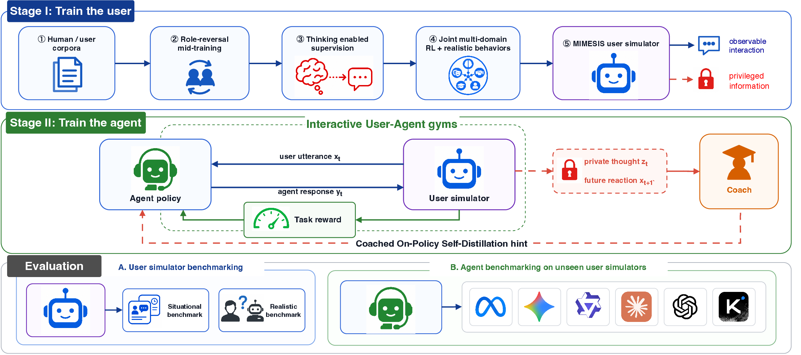

<p align="center">
  
</p>

<h1 align="center">MIMESIS</h1>

<p align="center"><b>Learning User Simulators as Training Environments for Interactive Agents</b></p>

<p align="center">
  <a href="https://arxiv.org/abs/2610.09484"></a>
  <a href="https://viethoang1512.github.io/mimesis/"></a>
  <a></a>
  <a href="#license"></a>
</p>

---

Simulated users offer a scalable alternative to costly human feedback, but they must both resemble real user behavior and provide useful learning experiences for agents. Most agent-training frameworks instead rely on off-the-shelf assistant LLMs, whose helpfulness can make them overly cooperative, explicit, and behaviorally homogeneous compared with real users.

**MIMESIS** is a purpose-built user simulator trained on human conversations with explicit reasoning supervision and 13 realistic behavioral patterns derived from real user interactions. We freeze the simulator and train agents by interacting with it using multi-turn reinforcement learning. Across eight environments, training with MIMESIS yields better agent performance than training with GPT-5.5 under all nine unseen user simulators.

<p align="center">
  
</p>


**Coached On-Policy Self-Distillation (CSD)** uses a coach to write concise coaching notes on the agent's responses and turns these notes into dense, token-level supervision beyond sparse task rewards, while the deployed agent relies only on public dialogue.


## News

- **2026-10-07**: Paper released on [arXiv](https://arxiv.org/abs/2610.09484) together with code.

## Highlights

**Our 9B model surpasses frontier models on SOUL-Index, RealUserSim, τ-USI, and SimulatorArena.** Scores for MIMESIS and frontier API models on each benchmark:

| Benchmark | MIMESIS-9B | MIMESIS-4B | GPT-5.5 | Claude-Opus-5 | Gemini-3.8-Flash |
|---|---:|---:|---:|---:|---:|
| SOUL-Index, simulation capability ↑ | **65.7** | 63.7 | 64.1 | 64.9 | 62.5 |
| RealUserSim PT3, behavioral fidelity ↑ | **94.0** | 89.7 | 76.5 | 80.6 | 67.2 |
| SimulatorArena, Turing distance ↓ | **38.7** | 42.0 | 48.7 | 42.3 | 46.7 |
| τ-USI, alignment with human users on τ-bench ↑ | **80.17** | 78.03 | 76.69 | 69.34 | 73.13 |

**Stronger generalization to new user simulators.** We evaluate whether a Qwen3-8B agent trained with MIMESIS generalizes to user models not encountered during training, across eight environments, three of them held out from training, and nine evaluation user models. Each cell is the mean task score across the eight environments:

| Evaluation user | GRPO w. GPT-5.5 | GRPO w. MIMESIS-9B | CSD w. MIMESIS-9B |
|---|---:|---:|---:|
| GPT-5.6 | 26.85 | 31.10 | **32.39** |
| Claude-Opus-5 | 25.75 | 27.21 | **29.78** |
| Claude-Sonnet-5 | 26.53 | 29.73 | **30.97** |
| Gemini-3.8-Flash | 26.33 | 30.88 | **31.09** |
| Kimi-K3 | 24.51 | 28.21 | **29.92** |
| Ditto-8B | 27.59 | 29.76 | **32.08** |
| Osim-8B | 25.68 | 29.27 | **29.72** |
| HumanLM-8B | 26.96 | 30.67 | **32.53** |
| Sotopia-7B | 24.72 | 29.00 | **31.35** |
| **Mean** | 26.10 | 29.54 | **31.09** |

With the GRPO objective fixed, replacing GPT-5.5 with MIMESIS-9B improves overall performance under every evaluation user, and CSD further improves performance under all nine. Per-environment results, more baselines, and qualitative examples are in the paper and on the [project page](https://viethoang1512.github.io/mimesis/).

## Repository layout

| Directory | What it contains | Start here |
|---|---|---|
| [`simulator/`](simulator) | Training and evaluation of the user simulator: role-reversal mid-training, ThoughtTrace reasoning SFT, joint multi-domain RL, and the SOUL, RealUserSim, τ-USI, SimulatorArena, and Turing evaluations.  | [`simulator/README.md`](simulator/README.md) |
| [`agent/`](agent) | Multi-turn GRPO and CSD training of a Qwen3-8B agent against a served simulator, plus the eight-environment evaluation under any user model. | [`agent/README.md`](agent/README.md) |

## Citation

```bibtex
@article{phan2026mimesis,
  title   = {{MIMESIS}: Learning User Simulators as Training Environments for Interactive Agents},
  author  = {Phan, Hoang and Huynh, Dat and Zhmoginov, Andrey and Zeng, Qi and Mu, Wancen and Cao, Yue and Bi, Shengjie and He, Yun and Oh, Changdae and Lei, Deren},
  journal = {arXiv preprint arXiv:2610.09484},
  year    = {2026}
}
```

## Acknowledgements

This work builds on [verl](https://github.com/volcengine/verl) and [UserRL](https://github.com/SalesforceAIResearch/UserRL), and on these datasets and benchmarks:

- **Training data and environments.** The OdysSim mid-training corpus and SOUL environments ([arXiv:2606.14199](https://arxiv.org/abs/2606.14199)), ThoughtTrace ([arXiv:2605.20087](https://arxiv.org/abs/2605.20087)), and ABCD.
- **Evaluation.** RealUserSim ([arXiv:2605.20204](https://arxiv.org/abs/2605.20204)), τ-bench ([arXiv:2406.12045](https://arxiv.org/abs/2406.12045)) with τ-USI ([arXiv:2603.11245](https://arxiv.org/abs/2603.11245)), and SimulatorArena ([arXiv:2510.05444](https://arxiv.org/abs/2510.05444)).
